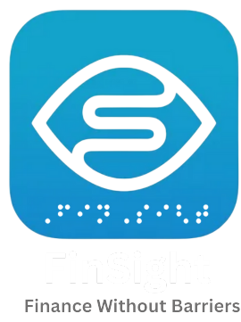
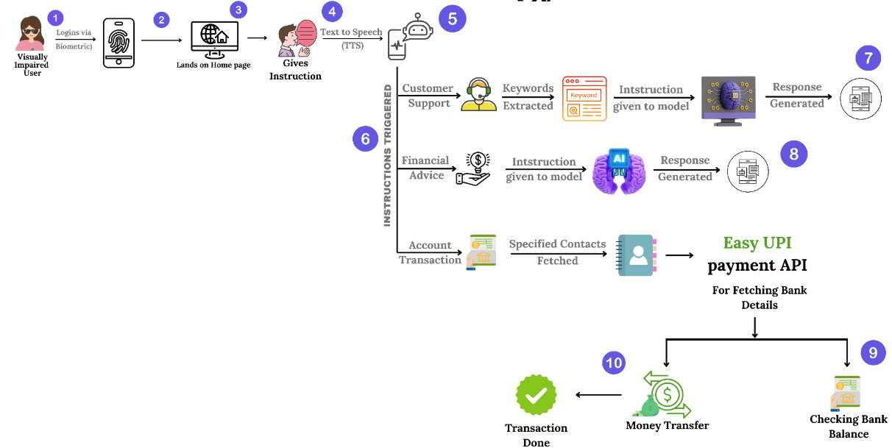

# Finsight - Finance without Barriers

The goal of this FinSight is to create a Voice-Based AI Customer Care platform for visually impaired users, enabling them to access financial services via voice commands. The system will allow users to check balances, pay bills, transfer money, and get personalized financial advice — all via voice interactions.

  

## Features

  

### 1. **AI-Driven Financial Insights**
   Leverage AI-driven financial insights using **Gemini** to deliver tailored recommendations on savings, budgeting, and investments. This empowers users to make informed financial decisions and improve their financial literacy.

### 2. **Easy UPI Integration**
   Integrate with the **Easy UPI Flutter plugin** for seamless transaction processing and account balance checks. The app extracts relevant details such as amount and account information, enabling efficient banking operations.

### 3. **Speech-to-Text and Text-to-Speech (TTS/STT) Integration**
   Utilize the **TTS and STT plugins in Flutter**, along with a custom Dart script, to convert user speech into text, analyze intent by extracting keywords, and generate appropriate responses for the voice assistant, ensuring smooth interaction and functionality.

### 4. **Fingerprint Biometric Authentication**
   Employ **fingerprint biometrics** for user login through the **Flutter Local_auth plugin**, offering a seamless and secure authentication process that eliminates the need for passwords and enhances both security and convenience.

### 5. **24/7 Voice-Based Support**
   Provide round-the-clock voice-based support with real-time responses, notifications, and updates. The integration of **text-to-speech** and screen reader compatibility ensures users with visual impairments can interact with the app easily and receive timely updates.

   ## Challenges Faced

- **Integration of GPay:** NPCI approval is required for complete transactions, and while initiation is possible, full transaction completion is restricted due to security concerns.
- **Integration of Face Biometric:** The Flutter face biometric plugin faced issues with adapting to varying lighting conditions, which impacted its accuracy.
- **Integration of TTS and STT Service:** Configuring TTS and STT services for consistent performance across devices with different accents and voice patterns was a challenge.
- **Voice Assistant Accuracy:** Ensuring accurate recognition of user commands in noisy environments and fine-tuning NLP for varied speech patterns was difficult.
- **Maintaining Accessibility:** Balancing accessibility features with performance while ensuring a seamless experience for users with visual impairments was a major design challenge.

## Future Scope

- **NFC Tag Integration:** NFC tags will securely store user details (bank info, account numbers) for easy, tap-to-pay transactions, eliminating the need for QR code scanning, and enabling more independence for users with visual and motor impairments.
- **Expanded Accessibility Modes:** We will introduce additional accessibility features, including larger buttons, high-contrast screens, and voice-assisted navigation to cater to a wider range of disabilities, ensuring a seamless experience for all users.
- **Improved UI:** The app’s interface will be refined for better navigation and usability, focusing on simplicity, larger text, and a cleaner layout to enhance user experience, especially for those with visual impairments.
- **Advanced Voice Assistant:** The voice assistant will become more intelligent, supporting complex queries, personalized advice, and real-time transaction assistance, with multi-language support.
- **Face Biometric Authentication:** Face biometric authentication will be introduced to improve security and make login and transactions quicker and more secure, eliminating the need for passwords or PINs.

